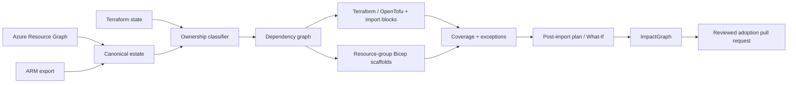

# Azure Brownfield to Infrastructure as Code

**Estate2Code converts declared Azure Resource Graph or ARM inventory into dependency-ordered Terraform/OpenTofu import scaffolds, Bicep scaffolds and an evidence-backed adoption report.**

[](https://github.com/AAH20/azure-brownfield-to-iac/actions/workflows/ci.yml)
[](pyproject.toml)
[](LICENSE)

Portal-built and legacy-scripted Azure estates are difficult to reproduce, review, migrate and operate. Azure exports can provide a starting point, but Microsoft warns that exports aren't guaranteed to produce production-ready templates. Estate2Code makes every preserved field, unsupported resource and manual decision explicit.

> **Evidence boundary:** normalization, Terraform-state classification, dependency ordering, seven resource mappings, Terraform imports, Bicep generation, coverage reports and tests are implemented. The eight-resource estate is synthetic. No live Azure discovery, import or deployment is claimed.

## Reproduce the reference case

No Azure account or third-party runtime dependency is required for the core pipeline:

```bash
bash scripts/validate.sh
```

Or run the compiler directly:

```bash
PYTHONPATH=src python3 -m estate2code.cli \
  examples/resource-graph-estate.json \
  --format resource-graph \
  --terraform-state examples/terraform-state.json \
  --output generated/reference
```

The example has eight resources: one already managed by Terraform, six additional supported resources and one deliberately unsupported Key Vault. The report shows `87.5%` resource-level Terraform scaffold coverage rather than hiding the gap.

## Architecture



## Implemented resource mappings

- Resource groups
- Virtual networks
- Network security groups
- Route tables
- Private DNS zones
- Storage accounts
- Log Analytics workspaces

The generator preserves a deliberately small property subset. Every generated Terraform resource includes `prevent_destroy = true`. Unsupported and unpreserved properties remain visible in the adoption report.

## Outputs

```text
terraform/main.tf                 constrained resource scaffolds
terraform/imports.tf              import blocks for unmanaged resources
bicep/<resource-group>.bicep      resource-group scoped Bicep
adoption-report.json              ownership, order, coverage and receipt
adoption-report.md                human-readable assessment
impactgraph/canonical-changes.json integration boundary for plan analysis
```

Generated Bicep is compiled in CI. A successful compilation proves syntax and type compatibility only—not equivalence with a live estate.

## GitHub Action

```yaml
- uses: AAH20/azure-brownfield-to-iac@main
  with:
    inventory: exports/resource-graph.json
    format: resource-graph
    terraform-state: exports/terraform-state.json
```

Never commit real Terraform state. For production use, pin an immutable commit rather than `main`.

## Safety model

- Read-only, offline-first assessment.
- Duplicate inventory identifiers are rejected.
- Dependency cycles fail closed.
- Already managed resources receive no duplicate import block.
- Unsupported resources are reported, not guessed.
- Provider defaults and omitted properties require review.
- The compiler never runs `terraform import`, `apply` or an Azure deployment.

Read [production acceptance requirements](docs/production-readiness.md) before using generated artifacts beyond evaluation.

## Distribution and role alignment

Azure Infrastructure as Code, Terraform import existing Azure resources, Azure Terraform migration, OpenTofu Azure, Bicep existing resources, Azure Resource Graph, Azure Verified Modules, Azure Landing Zone, brownfield cloud migration, configuration drift, Terraform state migration, platform engineering, Azure DevOps and Azure Solutions Architect.

## Work with A2Z SOC

Need to bring a portal-built or partially managed Azure estate under reviewed Infrastructure as Code?

**[Request an Azure brownfield IaC assessment](https://a2zsoc.com/contact?topic=azure-brownfield-to-iac&utm_source=github&utm_medium=repository).**
